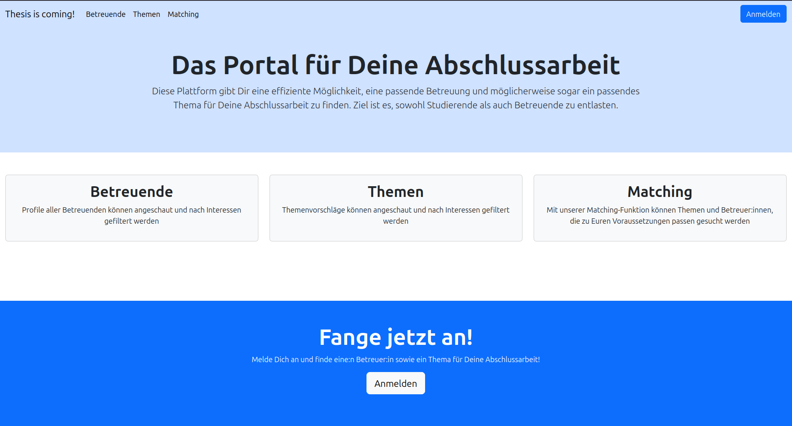

# Thesis



**Thesis** is a web-application connecting students with tutors and topics for their bachelor-thesis. It uses matching as well as filtering functions and offers tutors a very flexible profil edit option.

## Features

 - **Filtering:** Filter tutors and topics based on specific research fields and completed modules
 - **Matching:** Matching ranks tutors and topics based on specific research fields and completed modules


## Deployment
The project is dockerized for consistent deployment across different environments.

### Environment

The App needs a GitHub OAuth2 App and a PostgreSql Database Connection. The keys need to be entered in a env-file, that needs to contain the following information:

**applogin.env**
```env
#GitHub OAuth2 Connection
CLIENT_ID=your_client_id
CLIENT_SECRET=your_client_secret
#Database Connection
POSTGRES_USER=your_db_user
POSTGRES_PASSWORD=your_db_password
```

### Quick Start
1. Clone the repository using git
2. Configure your environment variables in the root directory as explained above
3. Launch the application with `docker compose up [-d]`
4. You can access the application under `http://localhost:8080`

## Technology Stack
### Backend / Frameworks
- Java
- Spring Boot
- Spring Security
- Spring Data JDBC
- Thymeleaf

### Build management and automation
- Gradle
- Docker
- Docker Compose

## Documentation
The Project was documented using the arc42-template.

## Credits
The project was written as a university project by a team of three computer science students.